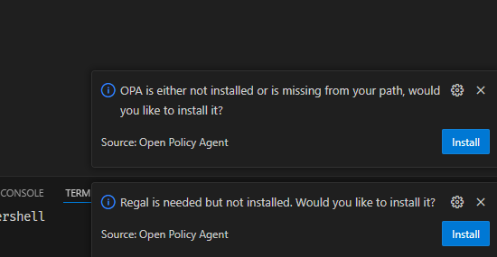

# reproduce-opa-vscode-bug-1

According to the documentation for the vscode plugin and `opa.ts` and `regal.ts`
files in the source code, it should be possible to use `${workspaceFolder}` in
the paths, but this doesn't seem to work on my windows machines.

This is what I get when restarting host when having `${workspaceFolder}` in
paths for `opa.dependency_paths.*` in `.vscode\settings.json` (workspace
settings). It is the same when setting the values in the user settings.json.



## Versions

### opa.exe

```text
Version: 0.69.0
Build Commit: 4a3fd1a715a8d24d102719421931020aafa8b778
Build Timestamp: 2024-09-30T13:09:00Z
Build Hostname: b5f50f3964b4
Go Version: go1.23.1
Platform: windows/amd64
WebAssembly: available
```

### regal.exe

```text
Version:    0.28.0
Go Version: go1.22.5
Platform:   windows/amd64
Commit:     9503967b3cd1d3725d078b04dd55ee9ec807b3f3
Timestamp:  2024-10-07T15:17:16Z
Hostname:   github.actions.local

```

### vscode

```text
Version: 1.94.2 (user setup)
Commit: 384ff7382de624fb94dbaf6da11977bba1ecd427
Date: 2024-10-09T16:08:44.566Z
Electron: 30.5.1
ElectronBuildId: 10262041
Chromium: 124.0.6367.243
Node.js: 20.16.0
V8: 12.4.254.20-electron.0
OS: Windows_NT x64 10.0.22631

```

### Open Policy Agent plugin

```text
Published: 2018-05-11, 22:05:10
Last released: 2024-10-07, 17:22:39
Last updated: 2024-10-07, 23:35:09
Identifier: tsandall.opa
```
